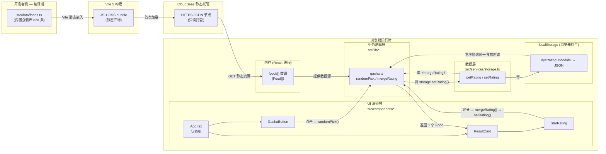

# TECH_DESIGN.md — do you eat

> **版本**：v1.0（Day 5 定稿）
> **日期**：2026-09-20
> **状态**：已定稿，待 Day 6 脚手架
> **前置文档**：[PRD.md](PRD.md)（v1.0） / [research.md](research.md)
> **架构关键词**：纯前端、无后端、无数据库、客户端架构

---

## 0. 一句话技术路线（截图第一行就是这条）

> **React 18 + Vite 5 + TypeScript + CloudBase 静态网站托管 + 浏览器 localStorage。**
> 无后端、无数据库、无用户账号。
> 与 PRD 第六节「本项目永不做：后端服务器与数据库」一致。

---

## 1. 选型理由

### 1.1 整体路线
- **不引入后端**：PRD 第六节明确把"后端服务器与数据库"列为永不做；Mvp 13 条验收无一条要求跨设备、SSR、服务端持久化。所以**走无后端对这个 MVP 代价 ≈ 0**（详见今日沟通记录）。
- **不引入 TypeScript 之外的重量级**：保留学习价值与未来可复用性（React + Vite 是 5 年内事实标准）。

### 1.2 前端：React 18（拒 Vue / 原生 JS）
- 行业第一大、社区资源最多、中文英文都搜得到
- 任务示范路线指定 React
- Vue 不是不好，只是 React 资源更厚 → 出问题容易找到答案

### 1.3 构建：Vite 5 + TypeScript（拒 Next.js / CRA）
- Vite：冷启动 1 秒，`npm create vite@latest` 一行起项目；零配置
- TypeScript：让 `foods.ts` 内置数据有类型保护；Vite 模板自带
- Next.js 的杀手锏是 SSR，我们无后端用不上 → 徒增概念
- CRA（Create React App）已 deprecated

### 1.4 部署：CloudBase 静态托管（拒 Vercel / GitHub Pages）
- 任务示范路线指定 CloudBase
- win32 中文环境 → 国内访问速度关键
- CloudBase 自带 HTTPS / CDN / 与腾讯云账号体系打通
- Vercel/GitHub Pages 适合海外或不在乎国内速度时再选

### 1.5 存储：localStorage（拒 IndexedDB / localforage）
- MVP 用户评分数据量 ≪ 5 MB
- 浏览器原生 API、零依赖、同步调用、好讲清楚
- IndexedDB 适合海量结构化数据，本期无此量
- localforage 是套壳库，MVP 不需要

---

## 2. 项目结构

```
do-you-eat/
├── src/
│   ├── components/
│   │   ├── GachaButton.tsx        // 首页「抽」按钮
│   │   ├── ResultCard.tsx         // 抽卡结果展示：emoji + 名称 + 介绍 + 评分 + 打分区
│   │   ├── StarRating.tsx         // ★★★★★ 输入组件
│   │   ├── IntroHint.tsx          // 首页引导文案
│   │   └── App.tsx                // 顶层组件、状态机（首页 ↔ 抽卡中 ↔ 结果）
│   ├── lib/
│   │   ├── gacha.ts               // 纯函数：randomPick(foods) → Food
│   │   ├── rating.ts              // 纯函数：mergeRating(food, userScore) → DisplayRating
│   │   └── constants.ts           // 应用常量（动画时长、localStorage key 前缀等）
│   ├── data/
│   │   └── foods.ts               // 内置食物库（≥20 条 TS 数组，PRD B1）
│   ├── services/
│   │   └── storage.ts             // localStorage 封装：getRating / setRating / clearAllRatings
│   ├── types/
│   │   └── food.ts                // 类型定义：Food / UserRating
│   ├── styles/
│   │   └── app.css                // 全局样式（CSS 变量、布局）
│   ├── main.tsx                   // Vite 入口、挂载 React
│   └── env.d.ts                   // import.meta.env 类型
├── vite.config.ts                 // Vite 配置（base / build / plugins）
├── tsconfig.json                  // TS 配置
├── package.json                   // 依赖与脚本
├── .gitignore
├── README.md
├── PRD.md
├── research.md
└── TECH_DESIGN.md                 // 本文档
```

> 三大角色落位（与板块② 分工一致）：
> - **UI 渲染层**：`src/components/*`
> - **业务逻辑层**：`src/lib/*`
> - **数据层**：`src/data/*` + `src/services/*`
> - **构建与发布**：`vite.config.ts` / `package.json` / CloudBase 平台

---

## 3. 数据模型

### 3.1 内置食物（`Food`）

```ts
// src/types/food.ts
export interface Food {
  id: string          // 唯一编号，如 'f001'
  name: string        // 名称，如 '麻辣香锅'
  image: string       // emoji 字符串（D2 决策），如 '🍲'
  rating: number      // 内置评分，3.0~5.0 浮点
  description: string // 一句话俏皮介绍
}
```

存储位置：`src/data/foods.ts`（TS 内置数组，**编译时**由 Vite 打包进 JS bundle）。

### 3.2 用户评分（`UserRating`）

```ts
// src/types/food.ts
export interface UserRating {
  foodId: string      // 关联到 Food.id
  score: number       // 1~5 整数
  updatedAt: number   // 写入时间戳，便于后续做冲突解决
}
```

存储位置：浏览器 `localStorage`（**运行时** 写入）。

**localStorage key 设计**：

| Key 形式 | Value 形式 |
|---|---|
| `dye:rating:<foodId>` | JSON.stringify( UserRating ) |

- **dye** = 项目名缩写（do-you-eat），防和其他站点冲突
- 每个食物独立一条记录 → 删除某条评分不会影响其他
- 不存数组根键 → 避免一颗老鼠屎坏了一锅汤（局部损坏不影响其他数据）

### 3.3 数据流向（一句话）

```
内置食物库：foods.ts → Vite 编译 → JS bundle → 浏览器内存（ foods[] 数组）
用户评分：  UI 点击 → 数据层 → 浏览器 localStorage → 再次读取回到 UI
```

详细见图 §8。

---

## 4. API 列表（模块间对外暴露函数）

> ⚠️ 本期**没有网络 API**。这里的"API"= 模块之间的对外函数签名（团队内部约定）。

### 4.1 数据层 — `src/services/storage.ts`

| 函数 | 入参 | 返回 | 失败行为 |
|---|---|---|---|
| `getRating(foodId)` | `string` | `UserRating \| null` | JSON 解析失败 → 返回 `null` |
| `setRating(foodId, score)` | `string, number` | `void` | localStorage 抛错 → 向上抛，由调用方 `try/catch` |
| `clearAllRatings()` | — | `void` | 调试用：清空所有 `dye:rating:*` |

### 4.2 业务层 — `src/lib/`

| 函数 | 入参 | 返回 | 说明 |
|---|---|---|---|
| `randomPick(foods)` | `Food[]` | `Food` | 严格随机，使用 `Math.random()`；不采用加权（PRD 第四节核心 = 纯随机） |
| `mergeRating(food, userRating)` | `Food, UserRating \| null` | `{ display: number; source: 'user' \| 'builtin' }` | PRD F3 规则 2：有用户评分优先展示；后缀用以决定 UI 是否显示"已记录你的评分" |

### 4.3 UI 层 — `src/components/`

| 组件 | Props（对外） | 状态（内部） |
|---|---|---|
| `App` | 无 | 当前页面状态：`idle` \| `gacha-running` \| `result` + 当前结果 Food |
| `GachaButton` | `onClick` | 无 |
| `ResultCard` | `food: Food`, `onReshuffle: () => void` | 展示用动画 class |
| `StarRating` | `foodId: string`, `value: number` | 临时输入态 |

---

## 5. 前后端数据流

按 PRD 第六节，本项目**不存在**前端/后端的网络交互：

| 不做的事 | 为什么不做 |
|---|---|
| ❌ 不发 `fetch` / `axios` / `XMLHttpRequest` | 无后端 |
| ❌ 不引入 SDK、API key、access token | 无后端鉴权 |
| ❌ 不配置反向代理、Nginx、CORS | 无服务端 CORS 问题 |
| ❌ 不引入 OAuth / JWT / Session | 无账号系统 |

数据流**全部**发生在单个浏览器进程内（详见 §8 数据流图）。

---

## 6. 错误处理

| 错误来源 | 处理策略 | 用户感知 |
|---|---|---|
| **localStorage 满**（5MB 用尽） | `setRating` 抛 `QuotaExceededError` → UI `try/catch` 捕获 → toast「评分未能保存」 | 评分 UI 仍可点；仅不持久 |
| **localStorage 被禁用**（隐私模式 / 用户关） | 同上："评分未保存" | 评分不持久 |
| **localStorage 数据被外部篡改**（JSON 损坏） | `getRating` 的 `JSON.parse` 包在 `try/catch` → 返回 `null` → 走内置评分 | 用户评分被静默重置，不报错 |
| **`foods.ts` 加载失败** | 几乎不可能（编译时打进 bundle）；兜底：catch 住 → 显示 "食物库加载失败，请刷新" | 不能抽卡 |
| **emoji 在用户系统显示成 □** | 不处理（系统责任）；数据层照常返回 | 仅视觉乱码，不影响数据 |
| **随机到空数组**（理论 bug 触发） | `randomPick` 入参校验 → 抛 "Foods empty"；UI 兜底显示"暂无可推荐食物" | 不能抽卡 |

### 6.1 全局约定

- **数据层永不 throw 给 UI**：所有 throw 都先在 `services/storage.ts` 内消化或包装后抛出，UI 层统一 `try/catch` + 上 toast
- **业务层不感知错误**：业务层认为数据层永远返回有效值或 `null`，不做防御
- **测试阶段的 `clearAllRatings`**：不在 UI 暴露入口，仅开发 DevTools 调用

---

## 7. 环境变量

### 7.1 项目侧（Vite 内置）

| 变量 | 用法 |
|---|---|
| `import.meta.env.MODE` | `'development'` / `'production'`；条件启用调试日志 |
| `import.meta.env.BASE_URL` | 部署子路径；本期走根路径 `"/"` |
| `import.meta.env.PROD` / `DEV` | 同 `MODE === 'production'` 的便捷别名 |

### 7.2 部署侧（CloudBase 控制台）

| 变量 | 用途 | 落位 |
|---|---|---|
| 环境 ID `envId` | 区分开发/生产环境 | `cloudbase.json` 或部署 CLI 参数 |
| secretId / secretKey | 仅本地 CLI 登录用，**不进代码** | `~/.cloudbase/.config.json`（本地，gitignore） |

> **铁律**：任何密钥、`.env`、凭据**永远不进代码库**。本地配置走全局 CLI 凭据；CI/CD 走平台变量注入。

---

## 8. 数据流图

> 用 Mermaid 画，对应板块② 给出的四层角色：UI 渲染层 / 业务逻辑层 / 数据层 / 构建与发布。



### 8.1 一句话读图

> 内置数据**出生在开发者电脑**，经 Vite 编译、CloudBase 托管，**第一次打开页面时**入住浏览器内存；用户评分**出生在浏览器**，**永远住在浏览器**，跨设备读不到。

---

## 9. 迁移注意事项（未来扩展怎么动）

### 9.1 哪天想打破"无后端"，路径如下

> 这是参考路径，不是承诺。未来真要做，分四步：

1. **抽接口位**：把 `services/storage.ts` 的 localStorage 逻辑抽到 `services/api.ts`，分别暴露 `fetchFoods() / getRating() / saveRating()` 三个函数
2. **实现远端版**：在 `api.ts` 内根据 `import.meta.env.VITE_USE_REMOTE` 切换 localStorage 与 fetch；云函数端用 `cloudbase-http` 或自定义 Express
3. **加数据迁移**：写一次 `migrateFromLocal()` 云函数，把当前用户 localStorage 的数据搬到 DB（用户可用"绑定手机号"触发）
4. **不动 UI / 业务层**：四层纪律就是为这一天设计的

### 9.2 常见改动场景的文件影响预估

| 假设改动 | 直接影响文件 | 间接影响文件 |
|---|---|---|
| **加一个数据字段**（如 `category`） | `src/types/food.ts` 加类型 / `src/data/foods.ts` 填数据 | `ResultCard.tsx`（如要展示）/ `PRD.md` 数据模型段 / 验收 A3 描述 |
| **加几条食物** | `src/data/foods.ts` 追加即可 | 无 |
| **换前端框架**（React → Vue） | `src/components/*`、`src/main.tsx`、`src/App.tsx` | `package.json`、`vite.config.ts`（如插件不兼容） |
| **换部署平台**（CloudBase → Vercel） | 无代码改动；改部署 CLI 与命令 | 无 |
| **换存储**（localStorage → IndexedDB） | 只动 `src/services/storage.ts` | 业务层、UI 层都不动 |
| **加云函数**（用户评分同步云端） | 新增 `cloudfunctions/*`；新增 `src/services/api.ts` | 不动 UI / 业务（前提：纪律不破） |

### 9.3 PRD 文档级影响

| 架构动作 | 必须回去改的 PRD 段落 |
|---|---|
| 引入后端 | 第六节（永不做列表删除"后端服务器与数据库"）<br>第 2 节产品形态段（"纯前端静态网页"改写）<br>第 7 节验收（可能要加 C4：跨设备同步测试） |
| 引入账号系统 | 第六节删除"用户账号系统 / 注册登录"<br>第 7 节验收（C3 不登录需求要改写） |
| 引入新数据字段 | 第 5 节数据字段表<br>第 7 节 A3、B1 描述 |

> 铁律：**架构级动作必须 PRD 与代码同步动**，否则文档和实现将长期打架。

### 9.4 数据迁移注意事项

- **版本号预留**：未来可在 `services/storage.ts` 写入 `dye:meta:schema_version` 一条记录，便于检测老数据格式
- **跨域/跨环境**：当前 localStorage 按 origin 隔离；引入云函数后，需明确"匿名用户的 ID" 怎么算
- **emoji vs 字体差异**：emoji 在不同系统显示差异大；如未来改用本地图片，**图片路径必须和 food.id 绑定**，否则图片和食物错配会很丑

---

## 10. 不在本期范围内（再强调一遍）

> 这些是 PRD 砍掉的功能；本技术文档**主动不实现**：

- ❌ 用户账号 / 注册登录
- ❌ 后端服务器 / 云函数 / API
- ❌ SQL / NoSQL 数据库
- ❌ SSR / SEO 优化
- ❌ 外卖平台 / 食堂数据对接
- ❌ 多人投票 / 社交
- ❌ AI 推荐

不写进 `package.json`，不写进 `src/`，不写进任何配置文件。等 PRD 改、用户拍板了再说。

---

## 11. 验收对齐表

| PRD 验收 | 本设计支撑点 |
|---|---|
| A1 打开即看到启动键 | `App.tsx` 默认状态 `idle`，渲染 `GachaButton` |
| A2 1~3 秒抽卡动画 | `App.tsx` 状态机 + CSS 动画；启动键 disabled 在 `gacha-running` 期间 |
| A3 配图+名称+介绍+评分齐全 | `ResultCard.tsx` 同时渲染 `image / name / description / rating` |
| A4 连续 10 次至少 2 种结果 | `randomPick` 用 `Math.random()` 不加权 |
| A5 「不行，重来」 | `ResultCard.tsx` 暴露 `onReshuffle` 回调，回到 `gacha-running` 状态 |
| A6 用户可打分 | `StarRating.tsx` |
| A7 刷新后保留用户评分 | `storage.setRating` 写 localStorage；`getRating` 读 |
| A8 重复打分取最新 | `setRating` 用 `foodId` 当 key 直接覆盖 |
| B1 ≥ 20 条食物、字段齐全 | `foods.ts` 编译期保证类型 |
| B2 配图缺失不报错 | D2 = emoji（系统级资源，没有"缺失"概念），自动满足 |
| C1 无外卖跳转/食堂数据入口 | 本文档 §5 已声明严禁 |
| C2 手机可正常完成 | 纯 SPA + 响应式 CSS |
| C3 不输入信息能完成 | 无登录、无输入项 |

> 13/13 全覆盖。

---

> 文档结束。下一步 → Day 6：基于本设计的项目脚手架（`npm create vite` 起 React + TS 模板；初始化目录；提交第一版基础框架）。
