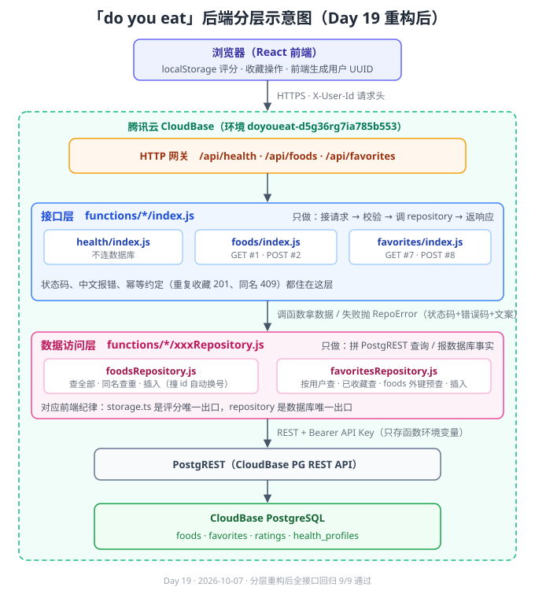

# 后端分层架构（Day 19 重构后）

## 一句话

数据库操作只住 repository 文件，接口层只做「接请求 → 校验 → 调函数 → 返响应」——
后端版的 `storage.ts` 唯一出口。

## 各层职责

| 层 | 住哪 | 只做什么 | 不做什么 |
|---|---|---|---|
| 网关 | CloudBase HTTP 网关 | 把 `/api/*` 路由到对应云函数（事件里 path 会剥掉绑定前缀） | 不含业务 |
| 接口层 | `functions/<名>/index.js` | 解析请求、参数校验、状态码与中文报错、幂等约定（重复收藏 201 / 同名 409） | 不认识 PostgREST |
| 数据访问层 | `functions/<名>/<表名>Repository.js` | 拼 PostgREST 查询、报数据库事实、失败抛 `RepoError` | 不定状态码、不做幂等决定 |
| 数据库 | CloudBase PostgreSQL | 4 张表：foods / favorites / ratings / health_profiles | — |

## 两条硬规则

1. **查 foods 表只走 `foodsRepository.js`，查 favorites 表只走 `favoritesRepository.js`**。绕开 repository 直接在 index.js 里 fetch，等于把未来换数据库的成本偷偷塞回接口层。
2. **数据层报事实，接口层定规矩**。例：`insertFavorite()` 撞复合主键返回 `'duplicate'`，但「撞了也回 201 幂等」是 Day 16 拍板的接口约定，判断留在 index.js。

## 报错传递

repository 查询失败抛 `RepoError`（带 status / code / message），
index.js 统一 try/catch 接住、原样转成 HTTP 响应——
数据库挂了（500 INTERNAL）和参数错了（400 BAD_REQUEST）在接口层一眼分开。

## 为什么 repository 分散在各函数目录、不抽公共文件

CloudBase 部署时**每个函数目录独立打包**，部署后 `require('../公共文件')` 会找不到文件。
所以 `RepoError` 等公共代码在每个函数里各有一份，这是部署模型的限制，不是偷懒。

## 换数据库的那天（本设计的收益）

体验版共享集群拿不到 PG 直连地址，才被迫走 PostgREST。将来升级正式版可直连时，
只需改 repository 文件里的实现，接口层一行不动，前端一行不动。

---
Day 19 · 2026-10-07 · 重构后全接口回归 9/9 通过（见 `.workbuddy/memory/2026-10-07.md`）
